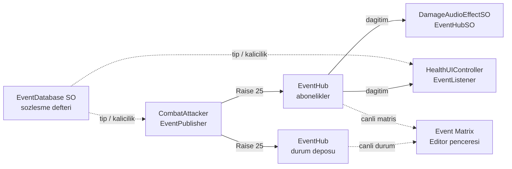

# EventHub

Unity için **isimli (string keyed), tip korumalı, durum hafızalı (stateful / blackboard) ve sahneler arası kalıcılık destekli** statik olay veriyolu.

Nesneler birbirine referans tutmak yerine **kanal adı** üzerinden konuşur. Geç abone olan bir dinleyici, kaçırdığı olayın **son değerini** hafızadan okuyabildiği için klasik C# `event` / `UnityEvent` yaklaşımlarındaki "kaçan olay" problemi ortadan kalkar.

```csharp
// Üretici: CombatAttacker.cs
EventHub.Raise("Combat/Player/OnTakeDamage", 25, this);

// Dinleyici: HealthUIController.cs
EventHub.Subscribe<int>("Combat/Player/OnTakeDamage", OnDamageReceived);

// Geç açılan UI, geçmişteki son değeri anında okur:
if (EventHub.TryGet<int>("Combat/Player/OnTakeDamage", out int sonHasar)) { /* ... */ }
```

---

## İçindekiler

- [Neden var?](#neden-var)
- [Mimari](#mimari)
- [Kurulum](#kurulum)
- [Hızlı Başlangıç](#hızlı-başlangıç)
- [Kanal Tanımlama (EventDatabase)](#kanal-tanımlama-eventdatabase)
- [API Referansı](#api-referansı)
- [Durum ve Kalıcılık](#durum-ve-kalıcılık)
- [Sahne Yaşam Döngüsü](#sahne-yaşam-döngüsü)
- [Editör Araçları](#editör-araçları)
- [Doğrulama](#doğrulama)
- [Tasarım Kararları](#tasarım-kararları)
- [Sınırlar ve Notlar](#sınırlar-ve-notlar)
- [Dosya Yapısı](#dosya-yapısı)

---

## Neden var?

Klasik yaklaşımlarda üretici ve dinleyici birbirine bağımlıdır:

- **Doğrudan referans / `GetComponent`** → sıkı bağlılık, sahne kurulumu kırılgan.
- **`UnityEvent`** → yalnızca inspector'da sürükleyip bırakma; kod taraflı, dinamik kanallar için zayıf.
- **`static event`** → tip güvenliği yok, "kaçan olay" var, ölü abonelik sızıntısı yapar.

EventHub bu üçünü birleştirir:

| İhtiyaç | EventHub'ın cevabı |
|---|---|
| Gevşek bağlılık | İsimli kanallar; üretici ve dinleyici birbirini bilmez |
| Tip güvenliği | Kanallar tiplidir; editörde yanlış tip abonelik/yayın yakalanır |
| Kaçan olay | Kanal "son değer"i hafızada tutar (blackboard) |
| Ölü abonelikler | `Destroy` olan obje `Raise` sırasında sessizce listeden sökülür |
| Sahne geçişleri | Sadece geçici (transient) durumlar temizlenir; kalıcı kanallar korunur |
| Performans | Kanal başına `List<Delegate>`, ters döngü, sıfıra yakın GC alloc |

### ScriptableObject event kanalları ile karşılaştırma

Unity'de yaygın alternatif, her olayı bir `ScriptableObject` asset'i olarak tanımlamaktır
(`IntEventChannel`, `VoidEventChannel` …): dinleyici asset referansını tutar, `OnEnable`/`OnDisable`
ile kaydolur. İkisi de gevşek bağlılık sağlar, ama farklı eksenlerde güçlüdür:

| | SO event kanalı | EventHub |
|---|---|---|
| Kanal tanımı | Kanal başına ayrı asset | Tek `EventDatabase` içinde satır |
| Bağlama | Inspector'da asset referansı | İsimden seçilen kanal (string) |
| Tip güvenliği | Derleme zamanı (generic SO tipi) | Editör zamanı (veritabanı denetimi + filtreli liste) |
| Geç abone olan dinleyici | Olayı kaçırır (durum yok) | Son değeri hafızadan okur |
| Durum / kalıcılık | Kanal SO'suna elle alan + sıfırlama politikası | Yerleşik blackboard + `isPersistent` |
| Merkezi görünürlük | Yok; asset asset dolaşmak gerekir | Event Database + Event Matrix + Event Audit |
| Ölü abonelik | `OnDisable` unutulursa sızar | `Raise` sırasında otomatik budanır |
| Ölçek | 50 kanal = 50 asset | Tek asset, 50 satır |
| İzole/çoklu bus, test izolasyonu | Kolay (asset'i kopyala, örnekle) | Yok; tek global static |
| Ek kod | Payload başına kanal sınıfı | Hazır payload tipleri |

Kısa karar rehberi: kanal sayısı artıyor, "son değer" önemli ya da geç açılan sahneler olayı
kaçırmamalıysa EventHub; bağlantıların tamamen inspector'da görünmesini ve derleme zamanı tip
güvenliğini istiyorsan SO kanalları daha uygun. İkisi birlikte de kullanılabilir (asılı kalma riski:
aynı kanalın iki farklı mekanizmayla temsil edilmesi).

---

## Mimari



**Akış:** `Raise` → (editörde sözleşme denetimi) → durumu güncelle → ters döngüyle dinleyicilere dağıt → ölü delegate'leri buda.

---

## Kurulum

1. `Assets/Scripts/EventHub/` klasörünü projene kopyala (Runtime + Editor).
2. **Bağımlılık:** Inspector'da `IEventPayload` tiplerini çok biçimli göstermek için
   [MackySoft.SerializeReferenceExtensions](https://github.com/mackysoft/Unity-SerializeReferenceExtensions) (`SubclassSelector`) gerekir.
   Bu depoda zaten `Packages/manifest.json` üzerinden UPM git bağımlılığı olarak gelir, elle kurulum gerekmez:
   ```json
   "com.mackysoft.serializereference-extensions": "https://github.com/mackysoft/Unity-SerializeReferenceExtensions.git?path=Assets/MackySoft/MackySoft.SerializeReferenceExtensions#1.7.0"
   ```
3. `Assets/Resources/` altında **Create → Architecture → Event Database** ile bir `EventDatabase` asset'i oluştur. (Dosya adı tam olarak `EventDatabase` olmalı; motor `Resources.Load<EventDatabase>("EventDatabase")` ile bulur.)

---

## Hızlı Başlangıç

### 1. Kanal tanımla
`EventDatabase` asset'inde bir olay ekle: `group = Combat/Player`, `eventName = OnTakeDamage`, `payload = IntPayload`.

### 2. Üretici (yayınla)

```csharp
public class CombatAttacker : MonoBehaviour
{
    [EventPublisher(typeof(int))]
    [SerializeField] private string damageChannel;   // Inspector: sadece Int kanalları listelenir

    void Update()
    {
        if (Keyboard.current.spaceKey.wasPressedThisFrame)
            EventHub.Raise(damageChannel, Random.Range(15, 30), this); // sender opsiyonel
    }
}
```

### 3. Dinleyici (abone ol)

```csharp
public class HealthUIController : MonoBehaviour
{
    [EventListener(typeof(int))]
    [SerializeField] private string damageListenerChannel;

    void OnEnable()  => EventHub.Subscribe<int>(damageListenerChannel, OnDamageReceived);
    void OnDisable() => EventHub.Unsubscribe<int>(damageListenerChannel, OnDamageReceived);

    void OnDamageReceived(int damage) => Debug.Log($"Hasar: {damage}");
}
```

### 4. Parametresiz (void) olaylar

```csharp
[EventPublisher(typeof(void))] [SerializeField] private string deathChannel;

EventHub.Raise(deathChannel, sender: this);   // payload yok
EventHub.Subscribe(deathChannel, OnPlayerDied);
```

### 5. ScriptableObject dinleyici

```csharp
[CreateAssetMenu(menuName = "Audio/Damage Audio Effect")]
public class DamageAudioEffectSO : EventHubSO
{
    [EventListener(typeof(int))] [SerializeField] private string onDamageEvent;

    public override void SubscribeEvents()   => EventHub.Subscribe<int>(onDamageEvent, Play);
    public override void UnsubscribeEvents() => EventHub.Unsubscribe<int>(onDamageEvent, Play);

    void Play(int damage) => Debug.Log($"SFX: {damage}");
}
```

`EventHubSO`, play moda girince otomatik `Register()`, çıkarken `Unregister()` yapar. Başka bir SO tabanından türediğin için `EventHubSO` miras alamıyorsan `IEventHubListener` arayüzünü uygula.

---

## Kanal Tanımlama (EventDatabase)

`EventDatabase` bir **sözleşme defteridir**: hangi kanalın hangi tipi taşıdığını ve kalıcı olup olmadığını ilan eder. Editörde kanal alanlarının açılır listesi bu tiplere göre filtrelenir ve yanlış tip kullanımı anında log'a düşer.

Hazır payload tipleri (`IEventPayload`): `VoidPayload`, `IntPayload`, `FloatPayload`, `StringPayload`, `BoolPayload`, `Vector3Payload`.

Kendi tipini eklemek için:

```csharp
[Serializable]
public class MyStructPayload : IEventPayload
{
    public Type DataType => typeof(MyStruct);
    public string DisplayName => "MyStruct";
}
```

---

## API Referansı

| Metot | Açıklama |
|---|---|
| `Subscribe<T>(kanal, Action<T>)` | Tipli dinleyici ekler. |
| `Unsubscribe<T>(kanal, Action<T>)` | Tipli dinleyiciyi çıkarır. |
| `Subscribe(kanal, Action)` | Parametresiz dinleyici ekler. |
| `Unsubscribe(kanal, Action)` | Parametresiz dinleyiciyi çıkarır. |
| `Raise<T>(kanal, payload, sender=null)` | Tipli olay yayınlar + durumu günceller. |
| `Raise(kanal, sender=null)` | Parametresiz olay yayınlar + durumu günceller. |
| `HasValue(kanal)` | Kanalda geçerli (tüketilmemiş) durum var mı? |
| `TryGet<T>(kanal, out T)` | Son değeri güvenle okur. |
| `Get<T>(kanal, fallback)` | Son değeri okur, yoksa fallback döner. |
| `Set<T>(kanal, value)` | Dinleyicileri tetiklemeden durumu doğrudan yazar. |
| `SetValid(kanal, bool)` | Geçerlilik bayrağını ayarlar. |
| `Invalidate(kanal)` | Durumu "tüketildi" işaretler (`HasValue = false`). |
| `ResetState(kanal, force=false)` | Kanalı sıfırlar (kalıcıysa `force` gerekir). |
| `ResetTransientStates()` | Yalnızca geçici durumları sıfırlar. |
| `ResetAllStates(includePersistent=false)` | Tüm durumları temizler. |
| `PruneDeadSubscribers()` | Ölü `UnityEngine.Object` aboneliklerini süpürür. |
| `IsPersistent(kanal)` / `SetPersistent(kanal, bool)` | Kalıcılık sorgusu / çalışma anı geçersiz kılma. |

---

## Durum ve Kalıcılık

EventHub iki katmanlıdır:

1. **Abonelik katmanı** — klasik pub/sub (`_subscriptions`).
2. **Durum katmanı (blackboard)** — kanal başına son değer + geçerlilik (`_states`).

Durum katmanı sayesinde:

```csharp
EventHub.TryGet("Combat/Player/OnTakeDamage", out int hp);  // geçmiş değer, şimdi okunabilir
EventHub.Set("Settings/Volume", 0.8f);                       // yayın yapmadan yaz
EventHub.Invalidate("UI/ToastReady");                        // "tüketildi" işaretle
```

**Kalıcı kanallar** sahne değişiminde silinmez:

```csharp
EventHub.SetPersistent("Meta/PlayerScore", true);   // çalışma anı geçersiz kılma
bool kalici = EventHub.IsPersistent("Meta/PlayerScore");
```

Kalıcılık, `EventDatabase`'deki `isPersistent` bayrağından veya çalışma anında `SetPersistent` ile zorlanabilir. `ResetState`, kalıcı kanalı kazara sıfırlamaya karşı korur (`force: true` ile aşılır).

---

## Sahne Yaşam Döngüsü

- `[RuntimeInitializeOnLoadMethod]` → hızlı play mode / domain reload kapalıyken statik hafızayı temizler.
- `SceneManager.sceneUnloaded` → ölü dinleyicileri budar (`PruneDeadSubscribers`) ve **sadece geçici** durumları süpürür (`ResetTransientStates`). Kalıcı kanallar RAM'de kalır.
- Editörde play modundan çıkışta tüm statik hafıza sıfırlanır.

---

## Editör Araçları

| Araç | Yol | Ne yapar |
|---|---|---|
| **Event Database** | `EventDatabase` asset inspector | Kanalları grup ağacı olarak gösterir, arama/filtre, çakışma uyarısı, ekle/sil. |
| **Event Channel Dropdown** | Diğer inspector alanları | `[EventPublisher]`/`[EventListener]` alanlarında tipe göre filtrelenmiş kanal seçimi. |
| **Event Matrix** | `Tools → Architecture → Event Matrix` | Canlı matris: kim yayınlıyor, kim dinliyor, kanalın anlık değeri ve kalıcılık durumu. |
| **Event Audit** | `Tools → Architecture → Event Audit` | Play'e girmeden statik denetim: prefab + ScriptableObject + açık sahnelerdeki tüm bağlamaları veritabanıyla karşılaştırır (boş kanal, tip uyuşmazlığı, çakışma, tanımsız kanal). |
| **Persistence Check** | `Tools/EventHubChecks/` | Derleme + çalıştırma kontrolü (bkz. [Doğrulama](#doğrulama)). |

---

## Doğrulama

Depoda çalıştırılabilir bir kontrol vardır:

```bash
Tools/EventHubChecks/run_persistence_check.sh
```

Çıktı: `ALL OK` veya `FAIL` satırları. Unity'nin ürettiği `.csproj`'a bağımlı değildir; EventHub runtime
kaynaklarını doğrudan derler. Kritik özellik: derleme **`UNITY_EDITOR` tanımlı olmadan** yapılır, yani
player build derlemesini de taklit eder. Editörde `UNITY_EDITOR` her zaman tanımlı olduğu için
"guard içinde tanımlı, dışında kullanılan" üyeler Unity'de görünmez ve build'de kırılır; bu script onu yakalar.

Kapsam: kalıcılık geçersiz kılmaları, `Set` sırasında durum tipi değişimi, `ResetTransientStates`
davranışı. Görsel/etkileşimli doğrulama için `Event Audit` penceresi ve Unity konsolu kullanılır.

---

## Tasarım Kararları

- **`List<Delegate>`, multicast delegate yerine:** kanal bazında anlık silme ve düşük GC alloc.
- **Ters döngü ile dağıtım:** dinleyici kendini listeden çıkarırken index kayması olmaz.
- **Ölü obje zırhı:** `Destroy` edilmiş `UnityEngine.Object` abonelikleri dağıtım sırasında sessizce sökülür.
- **İstisna kalkanı:** bir dinleyici hata fırlatsa bile diğerleri çalışmaya devam eder (`try/catch` + `LogException`).
- **Void ve generic ayrımı:** parametresiz olaylar boxing yapmaz, ayrı tip-güvenli yol.
- **Sözleşme denetimi yalnızca editörde:** yayın/abonelik sırasında veritabanıyla tip karşılaştırması yapılır; build'de sıfır maliyet. Editör-only kod (`#if UNITY_EDITOR`) yalnızca çağrı yerleri de guard'lıysa kullanılır; korumasız çağrı player build'i kırar.
- **Liste serileştirilir, aramalar sözlükte:** `EventDatabase.events` düz `List` olarak kalır (Unity `Dictionary` serialize edemez); aramalar için `FullPath → tanım` indeksi ilk kullanımda kurulur ve liste değiştiğinde kendini yeniler. Böylece inspector, sıralama ve çakışma tespiti korunurken arama `O(1)` olur.

---

## Sınırlar ve Notlar

- Kanal anahtarları **string**'dir; derleme zamanında doğrulanmaz. Güvenlik **editörde** kurulur: kanal alanları `[EventPublisher]`/`[EventListener]` ile tipe göre filtrelenmiş açılır listeden seçilir ve `Event Audit` yanlış bağlamaları build almadan yakalar. Kanal sabitleri üretmek kasıtlı olarak tercih edilmez; amaç kanal seçiminin koddan değil inspector'dan yapılmasıdır.
- `EventDatabase` içinde aynı yol birden fazla tanımlıysa **ilki** geçerlidir (sözlük indeksi ilk kaydı tutar). Böyle bir çakışma sessizce yutulmaz; `Event Audit` "çakışma" olarak raporlar.
- `Event Audit` yalnızca **prefab'ları, ScriptableObject'leri ve o an açık olan sahneleri** tarar; kapalı sahne dosyaları kapsam dışıdır (dosyayı bozmadan okumanın güvenli bir yolu yok). Ayrıca bir kanalın "kullanılmıyor" görünmesi problem değildir: obje henüz spawn olmamış veya bilerek bağlanmamış olabilir.
- Sistem **tek bir global static** hub'dır; birden çok izole bus veya test izolasyonu hedeflenmemiştir.
- `SetPersistent` geçersiz kılmaları editör play modundan çıkışta temizlenir.

---

## Dosya Yapısı

```
Assets/Scripts/EventHub/
├── Runtime/
│   ├── EventHub.cs            # Çekirdek motor (static)
│   ├── EventDatabase.cs       # Sözleşme defteri (ScriptableObject)
│   ├── IEventPayload.cs       # Payload tip tanımları
│   ├── EventAttributes.cs     # [EventPublisher] / [EventListener]
│   ├── EventGroup.cs          # Sahne hiyerarşisinden kanal grubu
│   ├── EventHubSO.cs          # SO dinleyici iskeleti
│   └── IEventHubListener.cs   # SO/sınıf dinleyici arayüzü
├── Editor/
│   ├── EventChannelDrawer.cs   # Tipli kanal açılır menüsü
│   ├── EventMatrixWindow.cs    # Canlı olay matrisi
│   ├── EventDatabaseEditor.cs  # Gruplu, aranabilir veritabanı inspector'ı
│   └── EventAuditWindow.cs     # Play'siz statik bağlama denetimi
└── Test/
    ├── CombatAttacker.cs      # Örnek üretici
    ├── HealthUIController.cs  # Örnek MonoBehaviour dinleyici
    └── DamageAudioEffectSO.cs # Örnek ScriptableObject dinleyici

Tools/EventHubChecks/
├── PersistenceCheck.cs           # Çalıştırılabilir kalıcılık kontrolü
└── run_persistence_check.sh      # Derler ve çalıştırır (UNITY_EDITOR'siz)
```

---

## Lisans

Bu projenin lisansı için depo sahibine başvurun.
