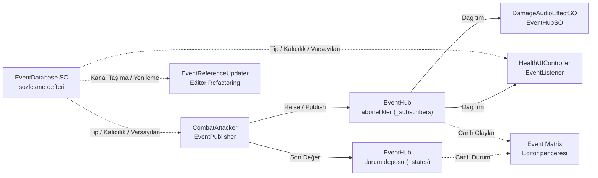

# EventHub

Unity için **isimli (string keyed), tip korumalı, durum hafızalı (stateful / blackboard) ve sahneler arası kalıcılık destekli** statik olay veriyolu.

Nesneler birbirine doğrudan referans tutmak yerine **kanal adı** üzerinden konuşur. Geç abone olan bir dinleyici, kaçırdığı olayın **son değerini** hafızadan okuyabildiği için klasik C# `event` / `UnityEvent` yaklaşımlarındaki "kaçan olay" problemi ortadan kalkar.

```csharp
// Üretici: CombatAttacker.cs
EventHub.Raise("Combat/Player/OnTakeDamage", 25, this); // sender opsiyoneldir

// Dinleyici: HealthUIController.cs
EventHub.Subscribe<int>("Combat/Player/OnTakeDamage", OnDamageReceived);

// Geç açılan UI, hafızadaki son değeri anında okur:
if (EventHub.TryGet<int>("Combat/Player/OnTakeDamage", out int sonHasar)) { /* ... */ }
```

---

## İçindekiler

- [Neden var?](#neden-var)
- [Mimari](#mimari)
- [Kurulum](#kurulum)
- [Hızlı Başlangıç](#hızlı-başlangıç)
- [Kanal Tanımlama (EventDatabase) & Payload Sistemi](#kanal-tanımlama-eventdatabase--payload-sistemi)
- [API Referansı](#api-referansı)
- [Durum ve Kalıcılık (Blackboard)](#durum-ve-kalıcılık-blackboard)
- [Sahne Yaşam Döngüsü](#sahne-yaşam-döngüsü)
- [Editör Araçları](#editör-araçları)
- [Doğrulama (Persistence Check)](#doğrulama-persistence-check)
- [Tasarım Kararları](#tasarım-kararları)
- [Sınırlar ve Notlar](#sınırlar-ve-notlar)
- [Dosya Yapısı](#dosya-yapısı)

---

## Neden var?

Klasik yaklaşımlarda üretici ve dinleyici birbirine bağımlıdır:

- **Doğrudan referans / `GetComponent`** → sıkı bağlılık, sahne kurulumu kırılgan.
- **`UnityEvent`** → yalnızca inspector'da sürükleyip bırakma; kod taraflı, dinamik kanallar için zayıf.
- **`static event`** → tip güvenliği yok, "kaçan olay" var, ölü abonelik sızıntısı yapar.

EventHub bu problemleri çözer:

| İhtiyaç | EventHub'ın cevabı |
|---|---|
| Gevşek bağlılık | İsimli kanallar; üretici ve dinleyici birbirini bilmez |
| Tip güvenliği | Kanallar tiplidir; editörde yanlış tip abonelik/yayın renkli uyarılarla yakalanır |
| Kaçan olay | Kanal "son değer"i hafızada tutar (blackboard) |
| Varsayılan değer | Kanallar başlangıç değeri taşıyabilir (`defaultValue`) |
| Sahne geçişleri | Kalıcı (`isPersistent`) kanallar RAM'de korunur, geçiciler temizlenebilir |
| Hızlı Yeniden Adlandırma | `EventReferenceUpdater` ile kanal adı değişince sahne, prefab ve SO referansları otomatik güncellenir |
| Statik Denetim | `Event Audit` penceresi oyunu başlatmadan eksik/hatalı bağlamaları ve tek tıkla DB'ye ekleme imkanı sunar |

---

## Mimari


```mermaid
flowchart LR
    A["CombatAttacker<br/>EventPublisher"]
    B["HealthUIController<br/>EventListener"]
    D["DamageAudioEffectSO<br/>EventHubSO"]
    C["EventHub<br/>abonelikler (_subscribers)"]
    S["EventHub<br/>durum deposu (_states)"]
    DB["EventDatabase SO<br/>sozlesme defteri"]
    M["Event Matrix<br/>Editor penceresi"]
    R["EventReferenceUpdater<br/>Editor Refactoring"]

    A -->|"Raise / Publish"| C
    A -->|"Son Değer"| S
    C -->|"Dagıtım"| B
    C -->|"Dagıtım"| D
    DB -.->|"Tip / Kalıcılık / Varsayılan"| A
    DB -.->|"Tip / Kalıcılık / Varsayılan"| B
    S -.->|"Canlı Durum"| M
    C -.->|"Canlı Olaylar"| M
    DB -.->|"Kanal Taşıma / Yenileme"| R
```

**Akış:** `Raise` / `Publish` → kanalın son durumunu güncelle (`_states`) → kayıtlı delegasyonları çağır → editörde `OnEventRaisedInEditor` tetikle (Event Matrix canlı izlesin).

---

## Kurulum

1. `Assets/Scripts/EventHub/` klasörünü projene kopyala (Runtime + Editor).
2. **Bağımlılık:** Inspector'da `IEventPayload` tiplerini çok biçimli göstermek için
   [MackySoft.SerializeReferenceExtensions](https://github.com/mackysoft/Unity-SerializeReferenceExtensions) (`SubclassSelector`) gerekir.
   Bu depoda zaten `Packages/manifest.json` üzerinden UPM git bağımlılığı olarak gelir:
   ```json
   "com.mackysoft.serializereference-extensions": "https://github.com/mackysoft/Unity-SerializeReferenceExtensions.git?path=Assets/MackySoft/MackySoft.SerializeReferenceExtensions#1.7.0"
   ```
3. `Assets/Resources/` altında **Create → Architecture → Event Database** ile bir `EventDatabase` asset'i oluştur. (Dosya adı tam olarak `EventDatabase` olmalıdır; motor `Resources.Load<EventDatabase>("EventDatabase")` ile bulur.)

---

## Hızlı Başlangıç

### 1. Kanal tanımla
`EventDatabase` asset'inde bir olay ekle: `group = Combat/Player`, `eventName = OnTakeDamage`, `payload = IntPayload` (varsayılan değer atanabilir).

### 2. Üretici (yayınla)

```csharp
public class CombatAttacker : MonoBehaviour
{
    [EventPublisher(typeof(int))]
    [SerializeField] private string damageChannel; // Inspector: sadece Int kanalları listelenir

    void Update()
    {
        if (Keyboard.current.spaceKey.wasPressedThisFrame)
        {
            // Publish veya Raise kullanılabilir (sender opsiyoneldir)
            EventHub.Raise(damageChannel, Random.Range(15, 30), this);
        }
    }
}
```

### 3. Dinleyici (abone ol)

```csharp
public class HealthUIController : MonoBehaviour
{
    [EventListener(typeof(int))]
    [SerializeField] private string damageListenerChannel;

    void OnEnable()  => EventHub.Subscribe<int>(damageListenerChannel, OnDamageReceived);
    void OnDisable() => EventHub.Unsubscribe<int>(damageListenerChannel, OnDamageReceived);

    void OnDamageReceived(int damage) => Debug.Log($"Hasar: {damage}");
}
```

### 4. Parametresiz (void) olaylar

```csharp
[EventPublisher(typeof(void))] [SerializeField] private string deathChannel;

// Yayınlama (sender parametresi isteğe bağlıdır)
EventHub.Raise(deathChannel, sender: this);

// Dinleme
EventHub.Subscribe(deathChannel, OnPlayerDied);
EventHub.Unsubscribe(deathChannel, OnPlayerDied);
```

### 5. ScriptableObject dinleyici

```csharp
[CreateAssetMenu(menuName = "Audio/Damage Audio Effect")]
public class DamageAudioEffectSO : EventHubSO
{
    [EventListener(typeof(int))] [SerializeField] private string onDamageEvent;

    public override void SubscribeEvents()   => EventHub.Subscribe<int>(onDamageEvent, Play);
    public override void UnsubscribeEvents() => EventHub.Unsubscribe<int>(onDamageEvent, Play);

    void Play(int damage) => Debug.Log($"SFX: {damage}");
}
```

`EventHubSO`, play moda girince otomatik `Register()`, çıkarken `Unregister()` yapar. Başka bir SO tabanından türediğin için `EventHubSO` miras alamıyorsan `IEventHubListener` arayüzünü doğrudan uygulayabilirsin.

---

## Kanal Tanımlama (EventDatabase) & Payload Sistemi

`EventDatabase` bir **sözleşme defteridir**: hangi kanalın hangi veri tipini taşıdığını, varsayılan değerini ve kalıcı olup olmadığını belirler.

### Payload Mimarisi

Tüm veri tipleri `IEventPayload` arayüzünü ve `EventPayload<T>` generic temel sınıfını kullanır:

- **`VoidPayload`**: Parametresiz sinyal olayları için kullanılır (`DataType = typeof(void)`).
- **`EventPayload<T>`**: Veri taşıyan olayların taban sınıfıdır. İçerisinde editörden atanabilen `defaultValue` barındırır.
  - Hazır tipler: `IntPayload`, `FloatPayload`, `BoolPayload`, `StringPayload`, `Vector3Payload`.

### Özel Bir Veri Tipi Eklemek

Projene özel bir veri tipi eklemek tek satırlık bir sınıftan ibarettir:

```csharp
[Serializable]
public struct InventoryItemData
{
    public int itemId;
    public int quantity;
}

[Serializable]
public class InventoryItemPayload : EventPayload<InventoryItemData> { }
```

Artık `EventDatabase` üzerinde `InventoryItemPayload` seçilebilir ve `[EventPublisher(typeof(InventoryItemData))]` ile kullanılabilir!

---

## API Referansı

### Olay Yayınlama & Dinleme (Pub / Sub)

| Metot | Açıklama |
|---|---|
| `Publish<T>(channel, data, sender = null)` | Tipli olay yayınlar ve hafızadaki (blackboard) durumunu günceller. |
| `Publish(channel, sender = null)` | Parametresiz (void) olay yayınlar. |
| `Raise<T>(channel, data, sender = null)` | `Publish<T>` için pratik alias. |
| `Raise(channel, sender = null)` | `Publish` için pratik alias. |
| `Raise<T>(sender, channel, data)` | `(sender, channel, data)` argüman sırasıyla tipli yayın aşırı yüklemesi. |
| `Subscribe<T>(channel, Action<T> callback)` | Belirtilen kanala tipli dinleyici ekler (`Delegate.Combine`). |
| `Unsubscribe<T>(channel, Action<T> callback)` | Belirtilen kanaldan tipli dinleyiciyi kaldırır (`Delegate.Remove`). |
| `Subscribe(channel, Action callback)` | Parametresiz dinleyici ekler. |
| `Unsubscribe(channel, Action callback)` | Parametresiz dinleyiciyi kaldırır. |

### Hafıza & Durum Yönetimi (Blackboard State)

| Metot | Açıklama |
|---|---|
| `TryGet<T>(channel, out T value)` | Kanalın son yayınlanan veya varsayılan değerini tip güvenli okur. |
| `HasValue(channel)` | Kanalda kayıtlı geçerli bir durum olup olmadığını döner. |
| `SetState<T>(channel, value, isPersistent = false)` | Dinleyicileri tetiklemeden durumu doğrudan hafızaya yazar. |
| `TryGetRawState(channel, out object rawValue, out bool hasValue, out bool isPersistent)` | Editör pencereleri veya genel teftiş için ham durum bilgilerini döner. |
| `Invalidate(channel)` | Kanalın durumunu geçersiz kılar (`HasValue = false`, `Value = null`). |
| `ClearNonPersistent()` | Yalnızca kalıcı olmayan (`isPersistent == false`) durumları temizler. |

---

## Durum ve Kalıcılık (Blackboard)

EventHub iki katmandan oluşur:

1. **Abonelik Katmanı** — `_subscribers` sözlüğü üzerinden delegasyon zinciri.
2. **Durum Katmanı (Blackboard)** — `_states` sözlüğü üzerinden son değer deposu.

Durum katmanı sayesinde:
- Geç açılan ekranlar (UI) veya sonradan sahneye giren nesneler olay geçmişini sorgulayabilir (`TryGet`).
- `SetState` ile aboneleri tetiklemeden durum yazılabilir.
- `Invalidate` ile durum tüketilmiş olarak işaretlenebilir.

### Kalıcılık (`isPersistent`)

`EventDatabase` üzerinde `isPersistent` işaretlenmiş kanallar sahne değişimlerinde korunur. Sahne geçişlerinde `EventHub.ClearNonPersistent()` çağrıldığında yalnızca geçici durumlar silinir; kalıcı kanallar hafızada kalır.

---

## Sahne Yaşam Döngüsü

- `[RuntimeInitializeOnLoadMethod(RuntimeInitializeLoadType.SubsystemRegistration)]` → Hızlı Play Mode / Domain Reload kapalıyken statik hafızayı (`_subscribers` ve `_states`) otomatik sıfırlar.
- Sahne geçişlerinde temizlik için projenin sahne yöneticisinden `EventHub.ClearNonPersistent()` çağrılabilir.

---

## Editör Araçları

### 1. Event Database Editor (`EventDatabase` Inspector)
- **Hiyerarşik Grup Ağacı**: `/` karakteri ile otomatik alt klasörler oluşturulur.
- **Klasör / Grup Sağ Tık Menüsü**:
  - `➕ Olay Ekle`: Gruba doğrudan yeni olay ekler.
  - `📁 Alt Grup Aç`: Yeni alt klasör hiyerarşisi oluşturur.
  - `✏️ Yeniden Adlandır`: Grubu ve bağlı tüm kanalları yeniden adlandırır.
  - `🗑️ Grubu Sil`: Onay kutusuyla grubu ve içindeki tüm olayları siler.
- **Olay Kartı Menüsü & Güvenli Silme**: Olay sağ tık veya `⋮` menüsü ile onay pencereli silme.
- **Inline Payload**: Varsayılan değer (`defaultValue`) doğrudan satır içinde düzenlenir.
- **Arama & Çakışma Kontrolü**: Yinelenen kanal isimlerini anında tespit eder ve uyarır.

### 2. Event Channel Drawer (`[EventPublisher]`, `[EventListener]`)
- **Renk Kodlu Durum Bildirimleri**:
  - 🟨 **Sarı**: Kanal seçilmedi (`[Seçilmedi] -> (Tip)`).
  - 🟥 **Kırmızı**: Kayıp olay; kanal veritabanından silinmiş veya adı değişmiş (`❌ Kayıp Olay`).
  - 🟧 **Turuncu**: Tip uyuşmazlığı; kanalın taşıdığı tip ile alanın beklediği tip eşleşmiyor (`❌ Tip Hatası`).
  - 🟩 **Normal**: Doğru eşleşme; kanal adı, varsa varsayılan değeri (`[Varsayılan: X]`) ve kalıcılık simgesi `💾` görüntülenir.
- **Gelişmiş Arama Açılır Menüsü (AdvancedDropdown)**:
  - Hedef tipe göre otomatik filtreleme.
  - Klasör yapısında gezinme ve hızlı arama çubuğu.
  - `✕ <Seçimi Temizle>` butonu.

### 3. Event Matrix Window (`Tools → Architecture → Event Matrix`)
- **Canlı Olay Takibi**: `EventHub.OnEventRaisedInEditor` entegrasyonuyla çalışma anında tetiklenen kanalları anlık izler.
- **Yayıncı & Dinleyici Tablosu**: Hangi nesne hangi kanala bağlı listelenir.
- **Hızlı Ping**: Listedeki nesneye tıklanarak sahnede veya Project görünümünde anında bulunması (`EditorGUIUtility.PingObject`) sağlanır.
- **ScriptableObject Desteği**: `IEventHubListener` uygulayan SO varlıklarını da tarayıp gösterir.

### 4. Event Audit Window (`Tools → Architecture → Event Audit`)
- **Oyunu Başlatmadan Statik Analiz**: Açık sahneler, prefab'lar ve ScriptableObject'lerdeki tüm `[EventPublisher]` ve `[EventListener]` alanlarını tarar.
- **Prefab vs Sahne Ayrımı**: Prefab üzerindeki boş kanallar `Uyarı (Warning)` olarak, aktif sahne nesnelerindeki boş kanallar ise `Hata (Error)` olarak raporlanır.
- **Hızlı Onarım (Quick Fix - "DB'ye Ekle")**: Kodda kullanılmış ancak henüz `EventDatabase`'e eklenmemiş kanalları tespit eder ve tek tıkla doğru veri tipiyle veritabanına ekler.

### 5. Event Reference Updater (`EventReferenceUpdater`)
- Kod refactoring ve yeniden adlandırma yardımcısı.
- Bir kanalın adı veya klasör yolu değiştiğinde:
  - Tüm açık sahnelerdeki MonoBehaviour'ları,
  - Projedeki tüm Prefab'ları,
  - Projedeki tüm ScriptableObject'leri,
  otomatik tarar ve eski kanal yolunu yeni yolla güncelleyip asset'leri kaydeder.
- Kullanım:
  ```csharp
  EventReferenceUpdater.UpdateAllReferences("OldGroup/OldEvent", "NewGroup/NewEvent");
  ```

---

## Doğrulama (Persistence Check)

EventHub'ın runtime derleme ve kalıcılık mantığını doğrulamak için harici script mevcuttur:

```bash
Tools/EventHubChecks/run_persistence_check.sh
```

- **Özellik**: `UNITY_EDITOR` sembolü olmadan derleme yapar; böylece player build ortamında kodun derlenip derlenmediğini (smoke test) doğrular.
- **Kapsam**: `SetState`, `TryGetRawState`, `ClearNonPersistent`, `HasValue`, `TryGet` kontrollerini çalıştırır.

---

## Tasarım Kararları

- **Sade & Hızlı Delegasyon**: Standart C# multicast delegasyon (`Delegate.Combine` / `Delegate.Remove`) ve `Dictionary<string, Delegate>` ile sadeleştirilmiş, performanslı yapı.
- **Generic Payload Tabanı**: `EventPayload<T>` sınıfı ile tüm veri tiplerine şablon oluşturma ve başlangıç değeri (`defaultValue`) sağlama imkanı.
- **Editör Merkezli Güvenlik**: String anahtarların kırılganlığı `EventChannelDrawer`, `EventAuditWindow` ve `EventReferenceUpdater` ile bertaraf edilmiştir.
- **Editör Canlı Dinleme Kancası**: `#if UNITY_EDITOR` korumalı `OnEventRaisedInEditor` sayesinde editör araçları motor performansını etkilemeden olayları dinler.

---

## Sınırlar ve Notlar

- Kanal anahtarları string tabanlıdır; yanlış yazımları önlemek için alanlarda `[EventPublisher]` / `[EventListener]` öznitelikleri kullanılmalıdır.
- `Event Audit` o an açık olan sahneleri, prefab'ları ve ScriptableObject'leri tarar; kapalı sahne dosyaları taranmaz.
- Sistem küresel bir statik veriyoludur.

---

## Dosya Yapısı

```
Assets/Scripts/EventHub/
├── Runtime/
│   ├── EventHub.cs               # Çekirdek motor ve Blackboard (static)
│   ├── EventDatabase.cs          # Olay sözleşme defteri (ScriptableObject)
│   ├── IEventPayload.cs          # EventPayload<T> ve temel tip tanımları
│   ├── EventAttributes.cs        # [EventPublisher] ve [EventListener]
│   ├── EventGroup.cs             # Sahne hiyerarşisi kanal grubu
│   ├── EventHubSO.cs             # SO dinleyicileri için temel sınıf
│   └── IEventHubListener.cs      # SO dinleyici arayüzü
├── Editor/
│   ├── EventChannelDrawer.cs      # Renk kodlu, filtreli açılır kanal seçici
│   ├── EventMatrixWindow.cs       # Canlı olay ve durum matrisi
│   ├── EventDatabaseEditor.cs     # Klasör sağ tık, inline payload, silme onaylı DB editörü
│   ├── EventAuditWindow.cs        # Statik bağlama denetimi ve Quick Fix ("DB'ye Ekle")
│   └── EventReferenceUpdater.cs   # Sahne/Prefab/SO referans güncelleme aracı
└── Test/
    ├── CombatAttacker.cs         # Örnek üretici bileşen
    ├── HealthUIController.cs     # Örnek dinleyici ve geç abone olma örneği
    └── DamageAudioEffectSO.cs    # Örnek ScriptableObject dinleyicisi

Tools/EventHubChecks/
├── PersistenceCheck.cs           # Runtime kalıcılık ve build smoke testi
└── run_persistence_check.sh      # Bağımsız derleme ve çalıştırma betiği
```

---

## Lisans

Bu projenin lisansı için depo sahibine başvurun.
